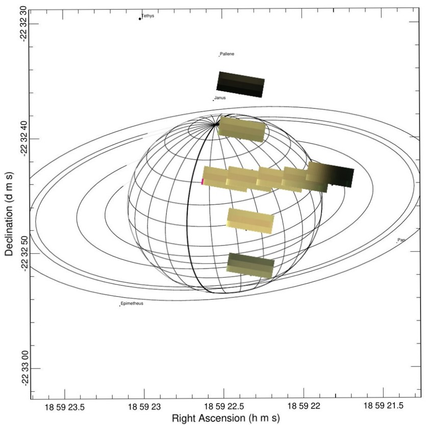

# planet_observation_through_time
The goal of this repository is to give a series of functions that allow locating the observations of a planet on its surface through time. To achieve this, rotation matrices are used on the planet, so that the planet is oriented at a convenient angle to handle its rotation.

 
